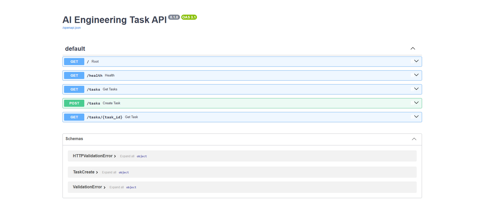
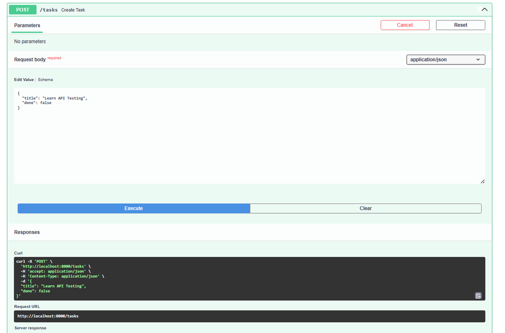
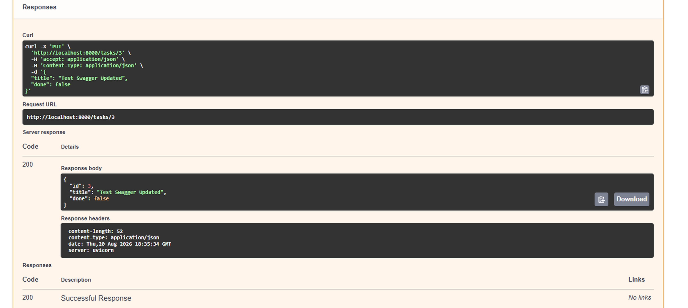
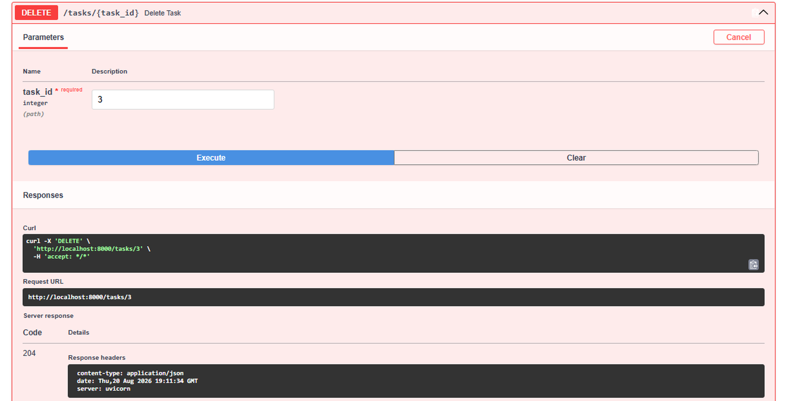
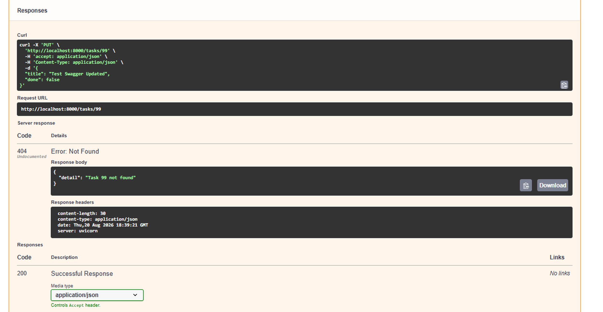

# AI Engineering Backend Task API

A production-oriented RESTful CRUD API built with **Python and FastAPI** as part of the **FlyRank AI Engineering Internship — Week 2, Task 1**.

## Project Overview

This project implements a task-management REST API supporting:

* Create, read, update, and delete operations
* Request validation with Pydantic
* Appropriate HTTP status codes
* Meaningful error handling
* In-memory task storage
* Interactive Swagger/OpenAPI documentation
* Incremental Git-based development

The application intentionally uses **in-memory storage** rather than a database, following the Week 2 assignment scope.

## Objectives

* Design RESTful API endpoints.
* Implement complete CRUD functionality.
* Apply appropriate HTTP status codes.
* Validate incoming API requests.
* Handle missing resources with meaningful errors.
* Document and test the API using Swagger UI.
* Demonstrate incremental Git-based development.
* Maintain a clean and traceable engineering workflow.

## Technology Stack

| Technology           | Purpose                            |
| -------------------- | ---------------------------------- |
| Python 3.12          | Programming language               |
| FastAPI              | Backend web framework              |
| Pydantic             | Request validation and data models |
| Uvicorn              | ASGI development server            |
| Swagger UI / OpenAPI | Interactive API documentation      |
| Git                  | Version control                    |
| GitHub               | Repository hosting                 |

## Architecture

```text
Client
  │
  │ HTTP Request
  ▼
FastAPI Application
  │
  ├── Route Handling
  ├── Request Validation
  ├── Business Logic
  └── In-Memory Task Store
  │
  ▼
HTTP Response
```

## API Endpoints

| Method | Endpoint           | Description             | Success | Error |
| ------ | ------------------ | ----------------------- | ------- | ----- |
| GET    | `/`                | API information         | 200     | —     |
| GET    | `/health`          | Health check            | 200     | —     |
| GET    | `/tasks`           | Retrieve all tasks      | 200     | —     |
| GET    | `/tasks/{task_id}` | Retrieve one task       | 200     | 404   |
| POST   | `/tasks`           | Create a new task       | 201     | 400   |
| PUT    | `/tasks/{task_id}` | Update an existing task | 200     | 404   |
| DELETE | `/tasks/{task_id}` | Delete a task           | 204     | 404   |

## Data Model

```json
{
  "id": 1,
  "title": "Learn FastAPI",
  "done": false
}
```

| Field   | Type    | Description            |
| ------- | ------- | ---------------------- |
| `id`    | Integer | Unique task identifier |
| `title` | String  | Task title             |
| `done`  | Boolean | Completion status      |

## HTTP Status Codes

| Status | Meaning     | Usage                    |
| ------ | ----------- | ------------------------ |
| 200    | OK          | Successful read/update   |
| 201    | Created     | Successful task creation |
| 204    | No Content  | Successful deletion      |
| 400    | Bad Request | Invalid request data     |
| 404    | Not Found   | Task does not exist      |

## Project Structure

```text
AI-Engineering-Backend-Task-API/
│
├── .gitignore
├── main.py
├── README.md
└── screenshots/
    ├── swagger-overview.png
    ├── post-201-created.png
    ├── put-200-updated.png
    ├── delete-204-no-content.png
    └── 404-not-found.png
```

## Local Setup

### 1. Clone the Repository

```bash
git clone https://github.com/costaspinto/AI-Engineering-Backend-Task-API.git
cd AI-Engineering-Backend-Task-API
```

### 2. Create a Virtual Environment

Windows PowerShell:

```powershell
python -m venv .venv
```

### 3. Activate the Virtual Environment

```powershell
.\.venv\Scripts\Activate.ps1
```

### 4. Install Dependencies

```powershell
python -m pip install fastapi uvicorn
```

### 5. Run the API

```powershell
uvicorn main:app --reload
```

The API will be available at:

```text
http://localhost:8000
```

## Swagger UI

FastAPI automatically generates interactive OpenAPI documentation.

Open:

```text
http://localhost:8000/docs
```

Use **Try it out** in Swagger UI to execute and verify the API endpoints.

### Swagger API Overview



### CRUD Verification

#### Create — `201 Created`



#### Update — `200 OK`



#### Delete — `204 No Content`



### Error Handling — `404 Not Found`



## Example Requests

### Get All Tasks

```bash
curl -i http://localhost:8000/tasks
```

### Get One Task

```bash
curl -i http://localhost:8000/tasks/1
```

### Create a Task

```bash
curl -i -X POST http://localhost:8000/tasks -H "Content-Type: application/json" -d '{"title":"Learn API Testing","done":false}'
```

Expected:

```text
HTTP/1.1 201 Created
```

### Update a Task

```bash
curl -i -X PUT http://localhost:8000/tasks/1 -H "Content-Type: application/json" -d '{"title":"Learn FastAPI Properly","done":true}'
```

Expected:

```text
HTTP/1.1 200 OK
```

### Delete a Task

```bash
curl -i -X DELETE http://localhost:8000/tasks/1
```

Expected:

```text
HTTP/1.1 204 No Content
```

## Error Handling

Requests for non-existent tasks return `404 Not Found`.

Example:

```bash
curl -i http://localhost:8000/tasks/99
```

Expected response:

```json
{
  "detail": "Task 99 not found"
}
```

The API therefore distinguishes missing resources from successful requests rather than incorrectly returning `200 OK`.

## Request Validation

Incoming task data is validated using Pydantic models.

Example request:

```json
{
  "title": "Learn API Testing",
  "done": false
}
```

The API expects:

* `title` as a string
* `done` as a boolean

## In-Memory Storage

Tasks are stored in a Python list:

```text
Client
  ↓
FastAPI
  ↓
Python list
```

Because the application uses in-memory storage, data is reset whenever the server restarts.

This is intentional and aligned with the assignment scope. Persistent database storage is identified as a future enhancement.

## Development Workflow

The API was developed incrementally, with each stage implemented and tested before moving to the next stage.

```text
Stage 0: hello server
Stage 1: root and health endpoints
Stage 2: read task endpoints
Stage 3: create task endpoint
Stage 4: update task endpoint
Stage 5: delete task endpoint
Stage 6: project documentation and submission assets
```

This approach creates a traceable Git history instead of relying on one large final-state commit.

## Git Commit History

The repository contains **7 meaningful development stages** covering the implementation from the initial server through documentation:

```text
Stage 0: hello server
Stage 1: root and health endpoints
Stage 2: read task endpoints
Stage 3: create task endpoint
Stage 4: update task endpoint
Stage 5: delete task endpoint
Stage 6: add project documentation
```

The staged workflow demonstrates incremental backend development, testing, and documentation.

## Testing Performed

The API was manually tested through Swagger UI.

Verified functionality includes:

* Root endpoint → `200 OK`
* Health endpoint → `200 OK`
* Retrieve all tasks → `200 OK`
* Retrieve an individual task → `200 OK`
* Retrieve an unknown task → `404 Not Found`
* Create a task → `201 Created`
* Retrieve the newly created task
* Update an existing task → `200 OK`
* Update an unknown task → `404 Not Found`
* Delete an existing task → `204 No Content`
* Delete an unknown task → `404 Not Found`

## Key Backend Concepts Demonstrated

* RESTful API design
* HTTP methods
* CRUD operations
* Request validation
* Pydantic data models
* HTTP status codes
* Error handling
* OpenAPI / Swagger documentation
* In-memory data management
* FastAPI route design
* Incremental Git development
* API testing

## Engineering Decisions

### Why FastAPI?

FastAPI was selected because it provides:

* Python-based backend development
* Type-hint-driven request validation
* Pydantic integration
* Automatic OpenAPI schema generation
* Built-in Swagger UI
* Clear and concise route definitions
* Strong suitability for modern AI/ML backend services

### Why In-Memory Storage?

The assignment focuses on implementing and validating CRUD request-response behavior without introducing database complexity.

An in-memory Python list therefore provides the required persistence model for the scope of this task.

### Why Incremental Commits?

Each major backend capability was developed as a separate stage.

This makes the Git history easier to review and demonstrates an engineering workflow based on incremental implementation and verification.

## Limitations

This implementation intentionally does not include:

* Persistent database storage
* Authentication or authorization
* Automated unit/integration test suite
* Pagination
* Filtering
* Production deployment
* Advanced logging
* Environment-based configuration

The limitations are consistent with the scope of the assignment.

## Future Improvements

Potential production-oriented extensions include:

* PostgreSQL integration
* SQLAlchemy or SQLModel
* Authentication and authorization
* Automated unit and integration tests
* Docker containerization
* CI/CD pipeline
* Pagination and filtering
* Structured logging
* Environment-based configuration
* Production deployment
* API versioning
* Database migrations
* Monitoring and observability

## Internship Context

**Program:** FlyRank AI Engineering Internship
**Track:** Backend Engineering
**Week:** 2
**Assignment:** A1 — Build Your First CRUD API

This project demonstrates the transition from understanding HTTP request-response concepts to implementing, testing, documenting, and version-controlling a functional backend API.

## Author

**Costas Pinto**

Master of Computer Applications
Specialization in Artificial Intelligence & Machine Learning

GitHub: https://github.com/costaspinto

## License

Created for educational and internship purposes as part of the FlyRank AI Engineering Internship.
